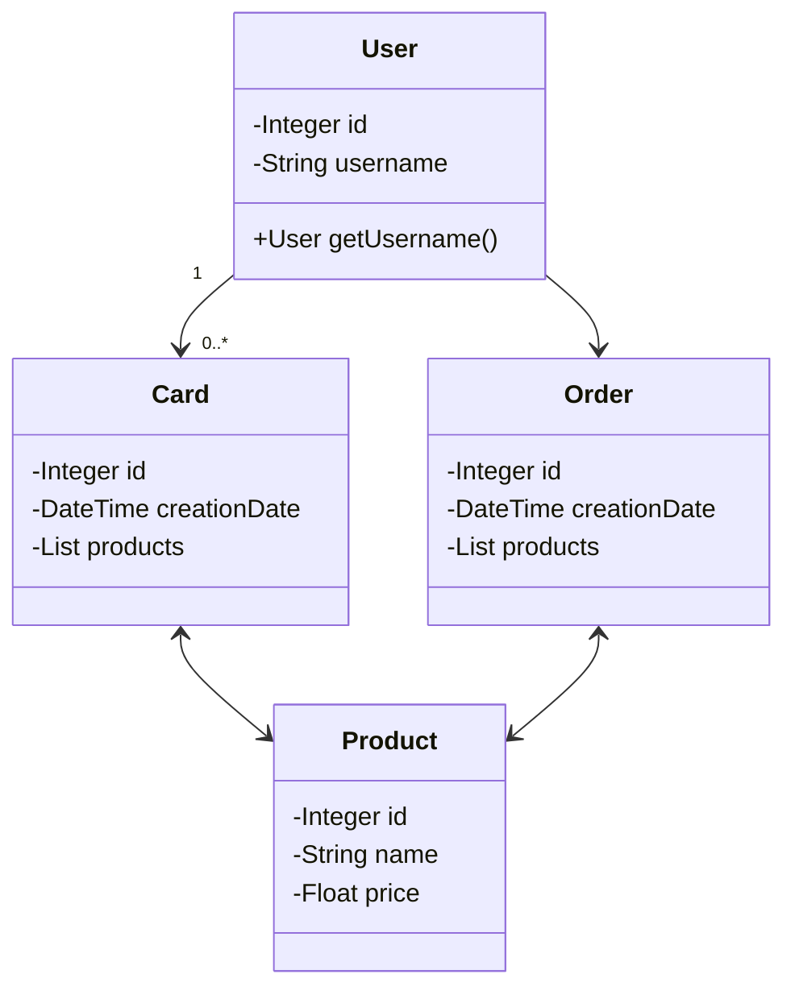

# Shop Springboot

## Installation

## Contributing

### Understanding the class diagram :

```mermaid
classDiagram
    User "1"-->"0..*" Card
    Card <--> Product
    Order <--> Product
    User --> Order
    
    class User {
      -Integer id
      -String username
      +User getUsername()
    }
    class Product {
        -Integer id
        -String name
        -Float price
    }
    class Card {
        -Integer id
        -DateTime creationDate
        -List<Product> products
    }
    class Order {
        -Integer id
        -DateTime creationDate
        -List<Product> products
    }
```